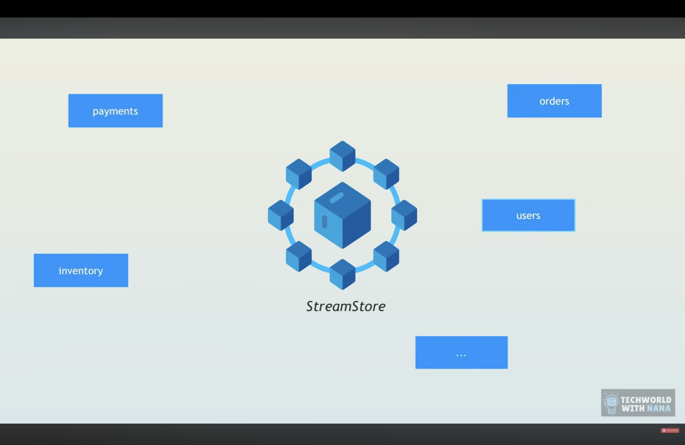
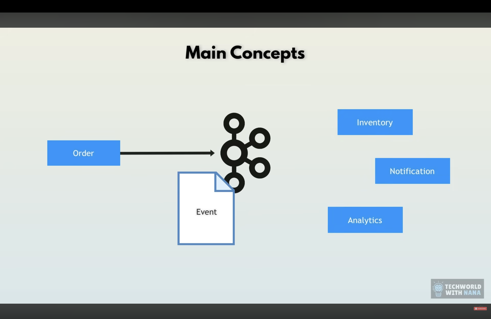

# Kafka: A Comprehensive Guide

## The Problem with Direct Database Operations

Modern applications face significant challenges when handling high-volume, real-time data streams:

### Real-World Examples

**Zomato - Live Delivery Tracking**
Zomato processes real-time data to show users the live location of delivery partners. If every location update directly hits the database, the system faces a critical bottleneck. The database's limited throughput (number of operations per second) would cause it to crash under the load of thousands of concurrent location updates.

**Discord - Real-Time Messaging**
Discord enables instant message delivery across millions of users. If every message triggered an immediate database write operation, the sheer volume of insertions would overwhelm the database, leading to system failure and poor user experience.

### The Core Issue
Traditional databases have limited **throughput** - the number of read/write operations they can handle per second. High-frequency operations like location tracking or messaging can easily exceed this capacity, causing system degradation or complete failure.

---

## Case Study: StreamStore E-Commerce Platform

### The Scenario
Imagine an e-commerce website called **StreamStore** with multiple microservices handling different business operations:

- **Order Service**: Processes customer orders
- **Inventory Service**: Manages product stock levels
- **Notification Service**: Sends order confirmations to customers
- **Billing Service**: Generates and sends invoices
- **Analytics Service**: Tracks sales data and metrics

### The Traditional Architecture Problem

When a customer places an order, a chain reaction is triggered:

1. **Order Service** receives the order
2. Calls **Inventory Service** to update stock (synchronous)
3. Calls **Billing Service** to generate invoice (synchronous)
4. Calls **Notification Service** to send confirmation (synchronous)
5. Calls **Analytics Service** to record the sale (synchronous)



### Critical Problems

#### 1. **Tight Coupling**
Each service directly calls the next service in the chain. The Order Service needs to know about and communicate with every downstream service, creating complex dependencies.

#### 2. **Synchronous Execution**
Services operate in a linear, step-by-step manner. The Order Service must wait for each service to complete before moving to the next, leading to:
- Slow response times for customers
- Poor user experience during high traffic
- Wasted resources waiting for operations to complete

#### 3. **Single Point of Failure**
If **any** service goes down or slows down, the **entire system** is affected:
- A 10-minute inventory service outage creates a 2-hour order backlog
- Customers can't place orders even though the Order Service is healthy
- All operations grind to a halt due to one failing component

#### 4. **Data Loss**
When services are unavailable:
- **Analytics Service** can't record critical sales data
- Business intelligence and reporting suffer
- Lost data means lost insights into customer behavior and revenue

#### 5. **Scalability Nightmare**
When traffic suddenly increases (e.g., during sales or holidays):
- Can't scale individual services independently
- Must scale the entire system even if only one service is bottlenecked
- Resource inefficient and expensive

### The Solution: Event-Driven Architecture with Kafka

**Decouple the services** using Kafka as an event streaming platform:



#### How It Works

1. **Order Service** places an order and publishes an **"Order Created" event** to Kafka
2. Multiple services independently subscribe to this event:
   - **Inventory Service** reads the event and updates stock
   - **Billing Service** reads the event and generates invoice
   - **Notification Service** reads the event and sends confirmation
   - **Analytics Service** reads the event and records the sale

#### Benefits of the Kafka Solution

**✅ Loose Coupling**
- Services don't know about each other
- Order Service only publishes events; it doesn't care who consumes them
- Easy to add new services without modifying existing ones

**✅ Asynchronous Execution**
- Order Service publishes the event and immediately responds to the customer
- Downstream services process events at their own pace
- Fast response times even under heavy load

**✅ Fault Tolerance**
- If Inventory Service goes down, orders still get recorded
- Kafka retains events, so when the service comes back up, it processes missed orders
- No data loss, no backlog crisis

**✅ Guaranteed Data Delivery**
- Events are persisted in Kafka
- Analytics Service gets all data even if it was temporarily down
- Complete audit trail of all business events

**✅ Independent Scalability**
- Each service scales based on its own load
- If Notification Service is slow, scale only that service
- Cost-efficient resource utilization

**✅ Real-Time Processing**
- All services process events in real-time
- Business operates efficiently even during traffic spikes
- Better customer experience with instant confirmations

#### Architecture Comparison

**Before Kafka (Synchronous):**
```
Order → Inventory → Billing → Notification → Analytics
(Each step waits for the previous one)
Total Time: Sum of all service times
Failure Impact: Complete system failure
```

**After Kafka (Asynchronous):**
```
Order → Kafka Topic: "order-events"
           ↓
    ┌──────┼──────┬──────┬──────┐
    ↓      ↓      ↓      ↓      ↓
Inventory Billing Notif. Analytics ...
(All services work independently)
Total Time: Only order publication time
Failure Impact: Isolated to individual services
```

---

## The Solution: Apache Kafka

### What is Kafka?
Kafka is a distributed event streaming platform designed for high-throughput, fault-tolerant data pipelines. It acts as a buffer between data producers and consumers, handling massive volumes of real-time data without overwhelming downstream systems.

### Key Characteristics
- **High Throughput**: Processes millions of messages per second
- **Low Latency**: Near-instantaneous message delivery
- **Limited Storage**: Not a replacement for databases; designed for temporary message retention
- **Distributed Architecture**: Horizontally scalable across multiple servers

### The Hybrid Approach
Kafka works **alongside** databases, not as a replacement:
1. Producers send high-frequency data to Kafka
2. Kafka buffers and streams the data efficiently
3. Consumers process messages and persist important data to the database at a manageable rate

---

## Kafka Architecture


### Core Components

#### 1. **Kafka Cluster and Brokers**

Kafka is designed to run as a **cluster** made up of multiple nodes, and these nodes are called **Kafka brokers**.

- A Kafka cluster consists of multiple brokers for high availability
- Each broker can handle thousands of reads and writes per second
- Brokers communicate with each other to replicate data
- Example: A typical production cluster might have 3-5 brokers

**What Brokers Do:**
- **Store and manage data**: All events that are created and consumed are stored on brokers
- **Organize data**: Messages are organized into topics and partitions
- **Handle requests**: Process read/write requests from producers and consumers
- **Ensure reliability**: Replicate data across brokers for fault tolerance

**Cluster Architecture:**
A Kafka cluster is shared by multiple Kafka brokers working together. Each broker:
- Has a unique ID
- Stores a subset of the cluster's partitions
- Communicates with other brokers for replication and coordination

**The Controller Broker:**
One of the brokers in the cluster has the special role of the **controller**.

**Controller Responsibilities:**
- **Manage cluster state**: Keeps track of which brokers are alive
- **Leader management**: Tracks which broker is the leader for each partition
- **Failure handling**: Reassigns partitions when a broker fails
- **Administration**: Handles all cluster administration tasks like creating/deleting topics

**Important:** At any given time, only **one broker** is the active controller. If the controller fails, a new one is automatically elected from the remaining brokers.

#### 2. **Topics**
Topics provide logical organization for messages, similar to tables in a database or folders in a file system.

- Producers specify which topic to publish messages to
- Topics are identified by name (e.g., `user-locations`, `chat-messages`)
- Each topic can handle a different type of data stream

#### 3. **Partitions**
Topics are divided into **partitions** for parallel processing and scalability.

- Each partition is an ordered, immutable sequence of messages
- Messages within a partition are assigned sequential IDs called **offsets**
- Partitions enable horizontal scaling - more partitions mean more parallel processing
- Example: A `delivery-locations` topic with 4 partitions can be processed by 4 consumers simultaneously

**Why Partitions Matter:**
- **Parallelism**: Multiple consumers can read from different partitions concurrently
- **Ordering**: Messages within a partition maintain strict ordering
- **Scalability**: Add more partitions to handle increased load

#### 4. **Producers**
Applications that publish messages to Kafka topics.

- Specify the target topic for each message
- Can optionally specify which partition to write to
- Examples: Mobile apps sending location updates, chat clients sending messages

#### 5. **Consumers**
Applications that read and process messages from Kafka topics.

- Subscribe to one or more topics
- Process messages at their own pace
- Can be grouped for load balancing and fault tolerance

#### 6. **Consumer Groups**
A powerful feature that enables both queue and pub-sub patterns.

**How Consumer Groups Work:**
- Multiple consumers can form a **consumer group** by sharing the same `group.id`
- Each partition is assigned to only **one consumer within a group**
- If you have 4 partitions, you can have up to 4 consumers in a group for parallel processing
- Adding a 5th consumer to a 4-partition topic would leave one consumer idle

**Example Scenario:**
```
Topic: user-events (4 partitions)
Consumer Group: analytics-processors

Consumer 1 → Partition 0
Consumer 2 → Partition 1
Consumer 3 → Partition 2
Consumer 4 → Partition 3
```

**Benefits:**
- **Load Balancing**: Work is distributed across consumers
- **Fault Tolerance**: If Consumer 2 fails, Partition 1 gets reassigned to another consumer
- **Scalability**: Match consumer count to partition count for optimal throughput

#### 7. **ZooKeeper and KRaft: Cluster Coordination**

**ZooKeeper (Legacy Approach - Kafka versions < 3.0)**

ZooKeeper was the traditional coordination service used by Kafka to manage cluster metadata and operations.

**Key Responsibilities:**
- **Cluster Management**: Maintaining a registry of all active brokers in the cluster
- **Leader Election**: Each Kafka partition has a leader broker, and ZooKeeper facilitates the election of partition leaders
- **Metadata and Configuration Management**: Storing and managing topic configurations, partition assignments, and access control lists (ACLs)
- **Health Monitoring**: Tracking broker health and triggering rebalancing when brokers fail

**Limitations of ZooKeeper:**
- External dependency requiring separate installation and maintenance
- Additional operational complexity with another system to monitor
- Scalability bottlenecks for large clusters
- Added latency in metadata operations

**KRaft: The Modern Solution (Kafka 3.0+)**

KRaft (Kafka Raft) is the new consensus protocol that **eliminates the dependency on ZooKeeper** entirely.

**What Changed:**
- Kafka now manages its own metadata internally using the Raft consensus algorithm
- No external coordination service required
- Built directly into Kafka brokers

**Benefits of KRaft:**
- **Simplified Architecture**: One less system to deploy, configure, and maintain
- **Better Scalability**: Supports clusters with millions of partitions (ZooKeeper struggled beyond 200,000)
- **Faster Operations**: Metadata operations are significantly faster without external coordination
- **Easier Deployment**: Fewer moving parts mean simpler setup and operations
- **Improved Recovery**: Faster leader election and cluster recovery times
- **Reduced Operational Overhead**: No need to manage ZooKeeper clusters separately

**Migration Timeline:**
- Kafka 3.0 (2021): KRaft introduced as early access
- Kafka 3.3 (2022): KRaft marked production-ready
- Kafka 4.0 (Future): ZooKeeper support will be completely removed

**For New Deployments:** Always use KRaft mode - it's the future of Kafka and provides better performance and operational simplicity.

---

## Setting Up Kafka with Docker

### Docker Compose Configuration

Below is a complete Docker Compose setup for running a **two-broker Kafka cluster** using KRaft mode (no ZooKeeper required).

```yaml
version: '3.8'

services:
  kafka-1:
    image: confluentinc/cp-kafka:7.5.0
    container_name: kafka-1
    ports:
      - "9092:9092"
    environment:
      # Enable KRaft mode - Kafka's built-in system to manage its own metadata
      # and handle cluster coordination internally without ZooKeeper
      KAFKA_KRAFT_MODE: 'true'
      
      # Unique cluster identifier shared by all brokers in the cluster
      CLUSTER_ID: '1L6g3nBhU-eAKfL--X25wo'
      
      # Unique ID for this broker (must be unique across the cluster)
      KAFKA_NODE_ID: 1
      
      # Defines the roles this broker will play
      # 'broker' = handles client requests (producers/consumers)
      # 'controller' = manages cluster metadata and leader elections
      KAFKA_PROCESS_ROLES: 'broker,controller'
      
      # List of controller brokers that can vote in cluster decisions
      # Format: NODE_ID@HOSTNAME:PORT
      # This defines which brokers participate in leader election and metadata management
      KAFKA_CONTROLLER_QUORUM_VOTERS: '1@kafka-1:9093,2@kafka-2:9093'
      
      # Internal listener for broker-to-broker and controller communication
      KAFKA_CONTROLLER_LISTENER_NAMES: 'CONTROLLER'
      
      # Defines the network listeners for different types of connections
      # PLAINTEXT: For client connections (producers/consumers)
      # CONTROLLER: For internal cluster coordination
      KAFKA_LISTENER_SECURITY_PROTOCOL_MAP: 'CONTROLLER:PLAINTEXT,PLAINTEXT:PLAINTEXT'
      
      # Advertised address that clients use to connect to this broker
      KAFKA_ADVERTISED_LISTENERS: 'PLAINTEXT://localhost:9092'
      
      # Addresses the broker listens on
      KAFKA_LISTENERS: 'PLAINTEXT://0.0.0.0:9092,CONTROLLER://0.0.0.0:9093'
      
      # Replication factor for the internal __consumer_offsets topic
      # This topic tracks which messages each consumer has read
      # Set to 1 for development (single broker setup)
      # Set to 3 for production (requires at least 3 brokers)
      KAFKA_OFFSETS_TOPIC_REPLICATION_FACTOR: 2
      
      # Replication factor for internal transaction state topic
      KAFKA_TRANSACTION_STATE_LOG_REPLICATION_FACTOR: 2
      
      # Minimum in-sync replicas for transaction log
      KAFKA_TRANSACTION_STATE_LOG_MIN_ISR: 2
      
      # Directory where Kafka stores log data
      KAFKA_LOG_DIRS: '/var/lib/kafka/data'
    volumes:
      - kafka-1-data:/var/lib/kafka/data
    networks:
      - kafka-network

  kafka-2:
    image: confluentinc/cp-kafka:7.5.0
    container_name: kafka-2
    ports:
      - "9093:9092"
    environment:
      KAFKA_KRAFT_MODE: 'true'
      CLUSTER_ID: '1L6g3nBhU-eAKfL--X25wo'
      
      # Different node ID for second broker
      KAFKA_NODE_ID: 2
      
      KAFKA_PROCESS_ROLES: 'broker,controller'
      KAFKA_CONTROLLER_QUORUM_VOTERS: '1@kafka-1:9093,2@kafka-2:9093'
      KAFKA_CONTROLLER_LISTENER_NAMES: 'CONTROLLER'
      KAFKA_LISTENER_SECURITY_PROTOCOL_MAP: 'CONTROLLER:PLAINTEXT,PLAINTEXT:PLAINTEXT'
      
      # Different advertised port for second broker
      KAFKA_ADVERTISED_LISTENERS: 'PLAINTEXT://localhost:9093'
      
      KAFKA_LISTENERS: 'PLAINTEXT://0.0.0.0:9092,CONTROLLER://0.0.0.0:9093'
      KAFKA_OFFSETS_TOPIC_REPLICATION_FACTOR: 2
      KAFKA_TRANSACTION_STATE_LOG_REPLICATION_FACTOR: 2
      KAFKA_TRANSACTION_STATE_LOG_MIN_ISR: 2
      KAFKA_LOG_DIRS: '/var/lib/kafka/data'
    volumes:
      - kafka-2-data:/var/lib/kafka/data
    networks:
      - kafka-network

volumes:
  kafka-1-data:
  kafka-2-data:

networks:
  kafka-network:
    driver: bridge
```

### Environment Variables Explained

| Variable | Description |
|----------|-------------|
| `KAFKA_KRAFT_MODE` | Enables KRaft consensus protocol (eliminates ZooKeeper dependency) |
| `CLUSTER_ID` | Unique identifier for the Kafka cluster (must be same across all brokers) |
| `KAFKA_NODE_ID` | Unique ID for each broker in the cluster (1, 2, 3, etc.) |
| `KAFKA_PROCESS_ROLES` | Roles this node plays: `broker` (handles client requests), `controller` (manages cluster) |
| `KAFKA_CONTROLLER_QUORUM_VOTERS` | List of brokers that participate in controller elections (format: `id@host:port`) |
| `KAFKA_CONTROLLER_LISTENER_NAMES` | Name of listener used for controller communication |
| `KAFKA_LISTENER_SECURITY_PROTOCOL_MAP` | Maps listener names to security protocols |
| `KAFKA_ADVERTISED_LISTENERS` | Address published to clients for connecting to this broker |
| `KAFKA_LISTENERS` | Addresses and ports this broker listens on |
| `KAFKA_OFFSETS_TOPIC_REPLICATION_FACTOR` | Number of copies of consumer offset data (impacts fault tolerance) |
| `KAFKA_TRANSACTION_STATE_LOG_REPLICATION_FACTOR` | Replication for transaction state logs |
| `KAFKA_TRANSACTION_STATE_LOG_MIN_ISR` | Minimum in-sync replicas required for transactions |
| `KAFKA_LOG_DIRS` | Directory where Kafka stores partition data |

### Key Configuration Notes

**Replication Factor:**
- **Development**: Set to `1` (single broker)
- **Production**: Set to `3` (requires at least 3 brokers)
- With 2 brokers, we use `2` for redundancy

**Controller Quorum:**
- Lists all brokers that can become controller
- Format: `NODE_ID@HOSTNAME:INTERNAL_PORT`
- Must include all controller-eligible brokers

**Listeners:**
- **PLAINTEXT**: Client connections (producers/consumers)
- **CONTROLLER**: Internal cluster coordination
- Brokers use different ports to avoid conflicts

### Running the Cluster

```bash
# Start the cluster
docker-compose up -d

# Check broker status
docker-compose ps

# View logs
docker-compose logs -f kafka-1
docker-compose logs -f kafka-2

# Stop the cluster
docker-compose down

# Stop and remove volumes (clean slate)
docker-compose down -v
```

### Testing the Setup

```bash
# Create a topic with 4 partitions and replication factor 2
docker exec -it kafka-1 kafka-topics --create \
  --topic test-topic \
  --partitions 4 \
  --replication-factor 2 \
  --bootstrap-server localhost:9092

# List topics
docker exec -it kafka-1 kafka-topics --list \
  --bootstrap-server localhost:9092

# Describe topic (shows partition distribution)
docker exec -it kafka-1 kafka-topics --describe \
  --topic test-topic \
  --bootstrap-server localhost:9092

# Produce messages
docker exec -it kafka-1 kafka-console-producer \
  --topic test-topic \
  --bootstrap-server localhost:9092

# Consume messages
docker exec -it kafka-1 kafka-console-consumer \
  --topic test-topic \
  --from-beginning \
  --bootstrap-server localhost:9092
```

---

## Queue vs. Pub-Sub: Kafka's Hybrid Model

### Traditional Queue (e.g., RabbitMQ)
- **Pattern**: First-In-First-Out (FIFO)
- **Consumption**: Each message consumed by **one** consumer
- **Use Case**: Task distribution, job queues

### Traditional Pub-Sub
- **Pattern**: Broadcast
- **Consumption**: Each message delivered to **all** subscribers
- **Use Case**: Event notifications, broadcasting updates

### Kafka's Approach: Best of Both Worlds

Kafka implements **both patterns simultaneously** using consumer groups:

**Queue Behavior (within a consumer group):**
- Consumers in the same group share the workload
- Each message processed by only one consumer in the group
- Ideal for parallel processing and load balancing

**Pub-Sub Behavior (across consumer groups):**
- Different consumer groups can subscribe to the same topic
- Each group receives all messages independently
- Perfect for multiple teams/services processing the same data stream

**Example:**
```
Topic: order-events

Consumer Group A (Order Processing Service)
  - Consumer A1 → Partition 0, 1
  - Consumer A2 → Partition 2, 3
  (Queue behavior within group)

Consumer Group B (Analytics Service)
  - Consumer B1 → All partitions
  (Pub-Sub behavior - gets all messages independently)

Consumer Group C (Notification Service)
  - Consumer C1 → All partitions
  (Pub-Sub behavior - gets all messages independently)
```

---

## Best Practices

### Optimal Partition-to-Consumer Ratio
- **Match consumer count to partition count** for maximum parallelism
- 4 partitions → 4 consumers in a group (ideal)
- 4 partitions → 2 consumers → Each handles 2 partitions (underutilized)
- 4 partitions → 6 consumers → 2 consumers sit idle (wasteful)

### When to Use Kafka
✅ High-frequency events (thousands/millions per second)  
✅ Real-time data streaming  
✅ Event sourcing and log aggregation  
✅ Multiple downstream consumers for the same data  

❌ Long-term data storage (use databases)  
❌ Complex queries and transactions (use databases)  
❌ Low-frequency, transactional data (direct database writes are fine)

## Errors I faced: 

``` python 
order-consumer  | %3|1762074824.055|FAIL|rdkafka#consumer-1| [thrd:localhost:9092/bootstrap]: localhost:9092/bootstrap: Connect to ipv4#127.0.0.1:9092 failed: Connection refused (after 0ms in state CONNECT, 558 identical error(s) suppressed)

backend-1       | %3|1762074825.308|FAIL|rdkafka#producer-1| [thrd:localhost:9092/bootstrap]: localhost:9092/bootstrap: Connect to ipv4#127.0.0.1:9092 failed: Connection refused (after 0ms in state CONNECT, 65 identical error(s) suppressed)
```

## **What's Happening:**

1. **`localhost:9092/bootstrap`** - Your consumer and producer are trying to connect to `localhost:9092`

2. **`Connect to ipv4#127.0.0.1:9092 failed`** - They're attempting to connect to IP address `127.0.0.1` (which is localhost) on port `9092`

3. **`Connection refused`** - The connection is being **rejected**

## **Why Connection Refused?**

In Docker, each container is isolated with its own network namespace. When your **consumer** or **backend** container tries to connect to `localhost:9092`:

- `localhost` (127.0.0.1) refers to the **container itself**, NOT the host machine
- Inside the consumer/backend container, there's NO Kafka running on port 9092
- So the connection is refused

## **Visual Explanation:**
```
┌─────────────────────────────────────────────────┐
│              Docker Network                     │
│                                                 │
│  ┌──────────────┐      ┌──────────────┐         │
│  │   Backend    │      │    Kafka     │         │
│  │  Container   │      │  Container   │         │
│  │              │      │              │         │
│  │ localhost ❌  │──X──▶│  kafka:9092  │         │
│  │   :9092      │      │              │         │
│  └──────────────┘      └──────────────┘         │
│         │                      ▲                │
│         │                      │                │
│         └──────────────────────┘                │
│            Should use "kafka:9092" ✅           │
└─────────────────────────────────────────────────┘
```

## Summary

Kafka solves the high-throughput problem by sitting between data producers and consumers, providing:
- **Buffering** to prevent database overload
- **Scalability** through partitioning
- **Flexibility** with consumer groups enabling both queue and pub-sub patterns
- **Fault tolerance** through replication and consumer group rebalancing

The partition-consumer relationship is key: with 4 partitions, you can run 4 consumers in parallel for optimal performance, ensuring each partition is processed independently while maintaining message ordering within each partition.