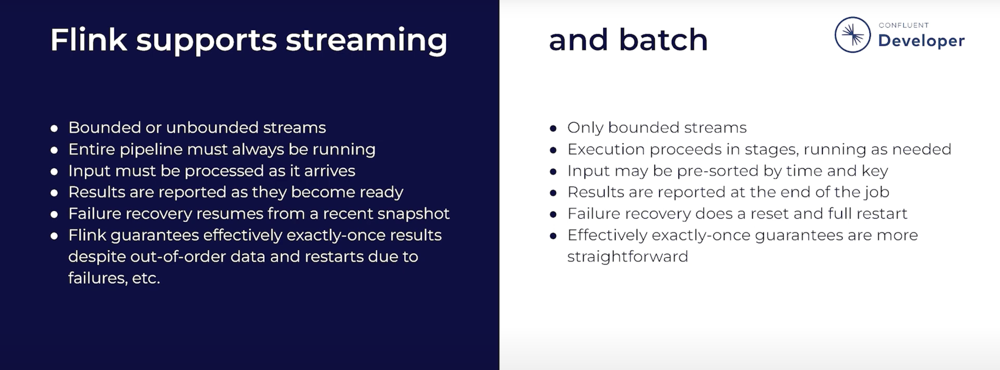

# Flink Runtime: The Engine That Powers Your Data Processing

## What is Flink Runtime?
Think of Flink Runtime as **the backstage crew at a concert** - you don't see them, but they make everything work smoothly while the show (your data processing) runs.

## Simple Kitchen Analogy

Imagine you're running a busy restaurant kitchen during dinner rush:

**Flink Runtime = Your Kitchen Operation**

- **👨‍🍳 Head Chef (JobManager)**
  - Reads all the orders coming in
  - Assigns dishes to different cooks
  - Notices when a cook is sick and reassigns their work
  - Makes sure food goes out in the right order

- **👩‍🍳 Line Cooks (TaskManagers)**
  - The workers who actually cook the food
  - Each station handles specific tasks (appetizers, main courses, desserts)
  - Process multiple orders simultaneously

- **🍽️ Kitchen Layout (Data Pipeline)**
  - Food flows from prep → cooking → plating → serving
  - Just like data flows through your processing steps

## Real-World Example

**Scenario:** You want to count how many people visit your website every minute

**What you write (your code):**
```java
"Count all website visits per minute"
```

**What Flink Runtime does:**

1. **Splits the work** across 10 machines (instead of 1 overworked computer)
2. **Processes data live** as visitors click on your site right now
3. **Keeps count accurately** even if data arrives out of order
4. **Recovers automatically** - if Machine #5 crashes, Machine #6 takes over without losing any counts
5. **Delivers results** every minute: "9:00 AM → 1,247 visits, 9:01 AM → 1,389 visits..."

## Streaming vs Batch: What's the Difference?



### 🌊 Streaming (Left Side - Dark Blue)
**Like watching live TV**

- **Bounded or unbounded streams** - Data can flow forever (like a never-ending river) or have an end
- **Pipeline always running** - Your processing job runs 24/7, constantly ready
- **Process as it arrives** - Each piece of data is handled the moment it comes in
- **Real-time results** - See outputs immediately as they're ready
- **Smart failure recovery** - Uses snapshots to resume right where it left off
- **Exactly-once guarantees** - Even with failures or out-of-order data, each event is counted exactly once

**Real Example:** Fraud detection on credit card transactions - catch suspicious activity within milliseconds

### 📦 Batch (Right Side - Light Gray)
**Like processing your monthly bank statement**

- **Only bounded streams** - Fixed dataset with a clear start and end
- **Runs in stages** - Processes in chunks, only when needed
- **Can be pre-sorted** - Data can be organized beforehand for efficiency
- **Results at the end** - Get all results when the job completes
- **Full restart on failure** - If something breaks, start over from the beginning
- **Simpler exactly-once** - Easier to guarantee since you can rerun the whole job

**Real Example:** Generate yesterday's sales report - process all of yesterday's transactions together

## What Flink Runtime Handles (So You Don't Have To)

| Challenge | How Runtime Solves It | Real Example |
|-----------|----------------------|--------------|
| **Massive Data** | Splits work across many machines | Processing 1 million transactions/sec instead of 1000 |
| **Speed** | Processes data as it arrives (streaming) | Fraud detection in milliseconds, not hours |
| **Failures** | Auto-recovery with checkpoints | Server crashes at 3 AM? Job continues automatically |
| **Coordination** | Synchronizes all machines | 100 machines working together like one |
| **Memory Management** | Prevents crashes from running out of RAM | Handles gigabytes of data without "out of memory" errors |

## Why Flink Does Both?

Flink Runtime is special because it handles **both streaming and batch** with the same engine:

- **Use Streaming when:** You need real-time insights (monitoring, alerts, live dashboards)
- **Use Batch when:** You're analyzing historical data (reports, analytics, data warehousing)
- **Best part:** Same code, same runtime - just different modes!

## Bottom Line

**You write:** "What I want to do with my data"  
**Flink Runtime handles:** "How to do it fast, reliably, across many machines"

It's like having a professional pit crew for your data - you focus on the race (your business logic), they handle the mechanics (distributed processing, fault tolerance, performance).

---

### Quick Mental Model
```
Your Code (Client)           Flink Runtime (Cluster)
     📝                              ⚙️
  "Count clicks"    →    [Distributes work across machines]
                         [Processes data in real-time]
                         [Handles failures automatically]
                         [Coordinates everything]
                              ↓
                         📊 Results
```

**Remember:** You're the architect drawing blueprints, Flink Runtime is the construction crew building the skyscraper!