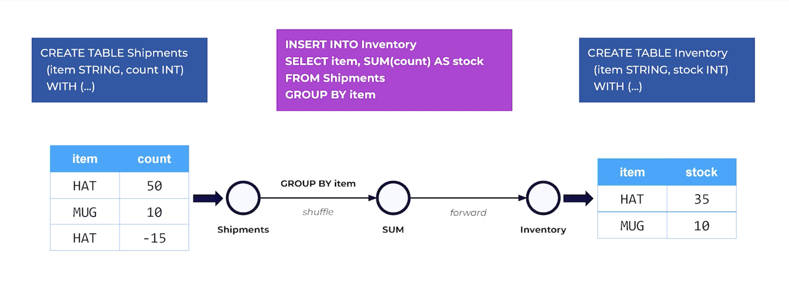

# Intro to Flink SQL: 
Flink SQL is bascially a way to write SQL queries ( like the ones you use on database ) but for live, real-time data 

- Apache Flink is a stream processing engine.
- Flink SQL lets you write SQL queries to process data streams (continuous data) and batch data (stored data).
- You don’t need to write complex code — SQL does the job.

## Example to understand:
Imagine you're receiving live ads data, clicks, or sales log every second. With normal SQL, you’d wait until data is stored and then run queries.

### But with Flink SQL, you can write queries like:
- “Count the number of clicks every 5 seconds”
- “Filter only high-value transactions immediately”
- “Join streaming data with static data”
- “Trigger alerts when something unusual happens right now”

## Example and Explanation:



- A stream of shipments coming in continuously
- Groups them by item
- Sums their quantities
- And outputs live updated stock into another table (Inventory)

### 📌 Logical Flow: Shipments → GROUP BY → Inventory
- Data flows into Shipments (stream input).
- Flink groups data by item → calculates SUM(count).
- Output goes to Inventory (table).


### How Streams and Tables are Actually Represented in Flink
This diagram goes deeper and explains:

- How a stream becomes a table
- And how the table becomes a stream again
- This is very important because Flink is STREAM + TABLE at the same time.

### 🧩 Part 1: Shipments Table → Stream of Changes
The left side shows:

```python 
CREATE TABLE Shipments...

With data:
item	count
HAT	     50
MUG	     10
HAT	    -15
```

👇 This becomes a stream of INSERT events in Flink:

```python 
+I[HAT, 50]
+I[MUG, 10]
+I[HAT, -15]
+I means INSERT
(Every record that arrives in a stream is an insert.)
```

This is your input stream.

### 🧩 Part 2: Flink SQL Query Applies Group By
Query:
```python 
SELECT item, SUM(count) AS stock
FROM Shipments
GROUP BY item

Flink now calculates running totals per item:

HAT:
+50 → stock = 50

-15 → stock = 35

MUG:
+10 → stock = 10
```

So the Inventory table becomes:

```python 
item	stock
HAT	    35
MUG	    10
```

### 🧩 Part 3: Table → Output Stream (Inventory Stream)
A table is not static — every time a value changes,
Flink emits updates to the output stream.

Those updates look like this:
```python
+I[HAT, 50]    -- First time HAT appears
-U[HAT, 50]    -- Remove old value (50)
+U[HAT, 35]    -- Insert new value (35)
+I[MUG, 10]    -- Insert new value (10)
These symbols mean:

Symbol	Meaning
+I	Insert a row
-U	Update before (remove old)
+U	Update after (add new)
-D	Delete row
```
In this diagram they show:

```python
✔️ When HAT goes from 50 → 35
Flink emits:

-U[HAT, 50] ➝ remove old value

+U[HAT, 35] ➝ insert new value
```

This is exactly how a dynamic table is represented internally as a stream.

### 🎯 Putting both diagrams together
Here is the combined explanation:

#### 🔵 Diagram 1 (High-Level):
Shows that you read from Shipments, group by item, and write to Inventory.

<b> Purpose: </b> <br>
Helps you understand what Flink SQL is logically doing.

#### 🟣 Diagram 2 (Deep-Level):
Shows how Flink actually works internally:

1. Input table = Stream of INSERTs
```python
+I[HAT, 50], +I[MUG, 10], +I[HAT, -15]
```

2. Flink SQL query updates dynamic table
```python
HAT: 50 → 35
MUG: 10
```

3. Output table = Stream of UPDATE events
```python
+I[HAT, 50]
-U[HAT, 50]
+U[HAT, 35]
+I[MUG, 10]
```
<b> Purpose: </b> <br>
Helps you understand:

- Why Flink tables are not static
- They are constantly changing with streaming data
- And are represented as a stream of changes

# Complete Guide to Flink SQL

## What is Flink SQL?

Flink SQL is a way to write SQL queries (like the ones you use on databases) but for **live, real-time data**.

- **Apache Flink** is a stream processing engine
- **Flink SQL** lets you write SQL queries to process:
  - **Streaming data** (continuous, real-time data)
  - **Batch data** (stored, historical data)
- You don't need to write complex code — SQL does the job

## Why Flink SQL?

Imagine you're receiving live data — ads clicks, sales logs, sensor readings — every second. With normal SQL, you'd wait until data is stored in a database and then run queries.

**But with Flink SQL, you can:**
- Count the number of clicks every 5 seconds
- Filter only high-value transactions immediately
- Join streaming data with static reference data
- Trigger alerts when something unusual happens right now
- Maintain running totals and aggregations in real-time

---

## Core Concepts

### 1. Dynamic Tables: Time-Traveling Tables

Unlike traditional SQL where tables are static snapshots, **Flink tables are dynamic** — they continuously evolve with time.

Think of a dynamic table as:
- A note board where entries can be added, modified, or removed at any time
- A timeline of changes that expands forever
- SQL queries that run continuously, not just once

**Example:**
```sql
-- This query runs FOREVER, continuously updating results
SELECT item, SUM(count) AS stock
FROM Shipments
GROUP BY item
```

### 2. Streams and Tables: Two Sides of the Same Coin

In Flink, **streams and tables are interchangeable**:
- A **stream** can be viewed as a table (a changelog)
- A **table** can be viewed as a stream (of changes)

This is the secret sauce of Flink SQL! 🎯

---

## Understanding Change Events

### Types of Change Events

When Flink processes data, it emits change events:

| Symbol | Name | Meaning |
|--------|------|---------|
| `+I` | Insert | A new row is added |
| `-U` | Update Before | Old value is removed (retraction) |
| `+U` | Update After | New value is added |
| `-D` | Delete | Row is deleted |

**Example:**
```
+I[HAT, 50]    -- Insert: HAT with quantity 50
-U[HAT, 50]    -- Retract: Remove old HAT value (50)
+U[HAT, 35]    -- Update: Insert new HAT value (35)
+I[MUG, 10]    -- Insert: MUG with quantity 10
```

### 3. Retractions: Flink's Magic Broom 🧹

**Retractions** are how Flink corrects previous outputs:
- `-U[row]` tells downstream systems: "That old row isn't valid anymore!"
- `+U[row]` provides the replacement value

**Why it matters:**
- Enables accurate aggregations even as data changes
- Allows Flink to update previous results
- Many users get confused when their sinks receive both `-U` and `+U`

---

## Stream Types

Flink produces two types of output streams:

### 1. Append-Only Stream
- Contains only `+I` (insert) events
- Happens when your query doesn't update old rows
- Example: `SELECT * FROM stream WHERE value > 10`

### 2. Changelog Stream
- Contains `+I`, `-U`, `+U`, and sometimes `-D`
- Happens when state is updated (e.g., GROUP BY, aggregations)
- Example: `SELECT item, COUNT(*) FROM Orders GROUP BY item`

**Why important?** Downstream systems must understand whether they can handle only inserts or full changelogs.

---

## Working Example: Shipment Processing

### Scenario
You're tracking shipments coming in continuously and want to maintain a live inventory count.


### Setup
```sql
-- Input: Stream of shipments
CREATE TABLE Shipments (
  item STRING,
  count INT
) WITH (
  'connector' = 'kafka',
  'topic' = 'shipments'
);

-- Output: Live inventory
CREATE TABLE Inventory (
  item STRING PRIMARY KEY,
  stock INT
) WITH (
  'connector' = 'kafka',
  'topic' = 'inventory'
);

-- Processing: Group and sum
INSERT INTO Inventory
SELECT item, SUM(count) AS stock
FROM Shipments
GROUP BY item;
```

### Data Flow


#### Step 1: Shipments → Stream of Changes
Input data arrives:
```
item  | count
------|------
HAT   | 50
MUG   | 10
HAT   | -15
```

Becomes a stream:
```
+I[HAT, 50]
+I[MUG, 10]
+I[HAT, -15]
```
(Every record is an INSERT event)

#### Step 2: Flink SQL Query Applies GROUP BY
Query calculates running totals:
```
HAT: +50 → stock = 50
HAT: -15 → stock = 35
MUG: +10 → stock = 10
```

Inventory table state:
```
item | stock
-----|------
HAT  | 35
MUG  | 10
```

#### Step 3: Table → Output Stream
The dynamic table emits changes:
```
+I[HAT, 50]    -- First time HAT appears (stock = 50)
-U[HAT, 50]    -- Remove old value
+U[HAT, 35]    -- Insert new value (stock updated to 35)
+I[MUG, 10]    -- First time MUG appears
```

**Key Insight:** When HAT goes from 50 → 35:
- Flink emits `-U[HAT, 50]` (retract old)
- Then emits `+U[HAT, 35]` (insert new)

---

## Materialization and State

**Where does Flink keep running totals and aggregations?**

Answer: **State Backend** (e.g., RocksDB, Memory)

- When you run `SUM()`, `COUNT()`, or joins, Flink stores intermediate results
- This enables:
  - Fault tolerance
  - Recovery from failures
  - Correct updates over time

**Example:**
```sql
SELECT user_id, COUNT(*) as clicks
FROM ClickStream
GROUP BY user_id
```
Flink maintains a count for each `user_id` in state, updating it as new clicks arrive.

---

## Event Time and Watermarks ⏳

### What is Event Time?
- The timestamp when an event actually occurred
- Different from processing time (when Flink processes it)
- Critical for accurate time-based operations

### What are Watermarks?
Watermarks are Flink's heartbeat — they tell Flink:
> "All events with timestamp ≤ T have arrived"

**Why needed?**
- Data arrives out of order in real-world streams
- Late events can affect aggregation results
- Watermarks help Flink know when to finalize window results

**Example:**
```sql
-- Define event time column
CREATE TABLE Clicks (
  user_id STRING,
  click_time TIMESTAMP(3),
  WATERMARK FOR click_time AS click_time - INTERVAL '5' SECOND
) WITH (...);
```

This says: "Events can arrive up to 5 seconds late"

---

## Windows: Flink's Crown Jewel 👑

Windows divide infinite streams into finite chunks for processing.

### Window Types

#### 1. Tumbling Window
Non-overlapping, fixed-size windows
```sql
-- Count clicks every 5 seconds
SELECT 
  TUMBLE_START(click_time, INTERVAL '5' SECOND) as window_start,
  COUNT(*) as click_count
FROM Clicks
GROUP BY TUMBLE(click_time, INTERVAL '5' SECOND);
```

#### 2. Sliding Window
Overlapping windows
```sql
-- Count clicks in 10-second windows, sliding every 5 seconds
SELECT 
  HOP_START(click_time, INTERVAL '5' SECOND, INTERVAL '10' SECOND) as window_start,
  COUNT(*) as click_count
FROM Clicks
GROUP BY HOP(click_time, INTERVAL '5' SECOND, INTERVAL '10' SECOND);
```

#### 3. Session Window
Windows based on inactivity gaps
```sql
-- Group clicks into sessions with 30-second timeout
SELECT 
  SESSION_START(click_time, INTERVAL '30' SECOND) as session_start,
  user_id,
  COUNT(*) as clicks_in_session
FROM Clicks
GROUP BY 
  user_id,
  SESSION(click_time, INTERVAL '30' SECOND);
```

---

## Tables, Views, and Temporary Tables

### Permanent Catalog Tables
```sql
CREATE TABLE Orders (
  order_id STRING,
  amount DECIMAL(10, 2)
) WITH (
  'connector' = 'kafka',
  'topic' = 'orders'
);
```

### Temporary Tables
```sql
-- Only exists in current session
CREATE TEMPORARY TABLE TempOrders (
  order_id STRING,
  amount DECIMAL(10, 2)
) WITH (
  'connector' = 'datagen'
);
```

### Views
```sql
-- Logical view over existing tables
CREATE VIEW HighValueOrders AS
SELECT * FROM Orders WHERE amount > 1000;
```

---

## Connectors: Sources and Sinks

Flink SQL becomes practical with connectors that read from and write to external systems.

### Common Sources
- **Kafka** - Real-time event streams
- **Kinesis** - AWS streaming data
- **MySQL/PostgreSQL** - Database CDC (Change Data Capture)
- **File systems** - CSV, JSON, Parquet files
- **Datagen** - Generate test data

### Common Sinks
- **Kafka** - Output to topics
- **ElasticSearch** - Search and analytics
- **MySQL/PostgreSQL** - Write to databases
- **Iceberg** - Data lake tables
- **Print** - Console output (for testing)

**Example:**
```sql
-- Kafka source
CREATE TABLE Orders (
  order_id STRING,
  amount DECIMAL(10, 2)
) WITH (
  'connector' = 'kafka',
  'topic' = 'orders',
  'properties.bootstrap.servers' = 'localhost:9092',
  'format' = 'json'
);

-- Print sink for testing
CREATE TABLE OrderStats (
  total_orders BIGINT,
  total_amount DECIMAL(10, 2)
) WITH (
  'connector' = 'print'
);
```

---

## Execution Modes

Flink SQL can run in different modes:

### 1. Streaming Mode
- Processes unbounded data continuously
- For real-time pipelines

### 2. Batch Mode
- Processes bounded data (with a start and end)
- For historical data processing

### 3. Unified Runtime (Flink 1.18+)
- Single engine for both streaming and batch
- Automatically optimizes based on data

**Key Point:** The same SQL query can run on streaming or batch data depending on how the table is configured!

```sql
-- This query works in both modes!
SELECT department, AVG(salary)
FROM Employees
GROUP BY department;
```

---

## Advanced Features

### Temporal Joins: Time-Travel Joins

Join streaming data with versioned reference data **as it existed at that point in time**.

```sql
-- Join orders with customer data as it was when order was placed
SELECT 
  o.order_id,
  o.order_time,
  c.customer_name,
  c.customer_tier
FROM Orders AS o
LEFT JOIN Customers FOR SYSTEM_TIME AS OF o.order_time AS c
ON o.customer_id = c.customer_id;
```

This is incredibly powerful for accurate historical analysis!

### Upsert Sink Semantics

When your output contains `-U` + `+U`, many sinks treat this as an **UPSERT** (update or insert):

```sql
-- MySQL sink automatically handles upserts
CREATE TABLE UserStats (
  user_id STRING PRIMARY KEY,
  total_clicks BIGINT
) WITH (
  'connector' = 'jdbc',
  'url' = 'jdbc:mysql://localhost:3306/db',
  'table-name' = 'user_stats'
);
```

Useful for:
- MySQL/PostgreSQL databases
- Kafka with key-based compaction
- Any system that supports primary keys

### Primary Keys Reduce Overhead

Defining primary keys helps Flink optimize:
- Reduces retraction overhead
- Enables more efficient state storage
- Improves upsert performance

```sql
CREATE TABLE Products (
  product_id STRING PRIMARY KEY,
  product_name STRING,
  price DECIMAL(10, 2)
) WITH (...);
```

---

## Flink SQL Planner

Behind the scenes, Flink uses a query optimizer:

- **Blink Planner** (modern, default)
  - Optimizes how to join streams
  - Decides state management strategies
  - Pushes down filters and projections
  
The planner automatically:
- Chooses efficient join strategies
- Minimizes state size
- Optimizes resource usage

---

## Summary: Key Takeaways

1. **Flink SQL = SQL for streaming data** - Write familiar SQL for real-time processing
2. **Dynamic Tables** - Tables that continuously evolve with time
3. **Streams ↔ Tables** - Two representations of the same data
4. **Change Events** - `+I`, `-U`, `+U`, `-D` represent how data changes
5. **Retractions** - How Flink corrects previous outputs
6. **State Backend** - Where Flink stores intermediate results
7. **Event Time & Watermarks** - Handle out-of-order data correctly
8. **Windows** - Process infinite streams in finite chunks
9. **Connectors** - Connect to real data sources and sinks
10. **Execution Modes** - Same SQL for streaming and batch

---

## Next Steps

- Try Flink SQL with the [Print connector](https://nightlies.apache.org/flink/flink-docs-release-1.18/docs/connectors/table/print/) for testing
- Experiment with [time windows](https://nightlies.apache.org/flink/flink-docs-release-1.18/docs/dev/table/sql/queries/window-tvf/)
- Learn about [CDC (Change Data Capture)](https://github.com/ververica/flink-cdc-connectors) for database streaming
- Explore [Flink SQL documentation](https://nightlies.apache.org/flink/flink-docs-release-1.18/docs/dev/table/sql/overview/)

Happy streaming! 🚀