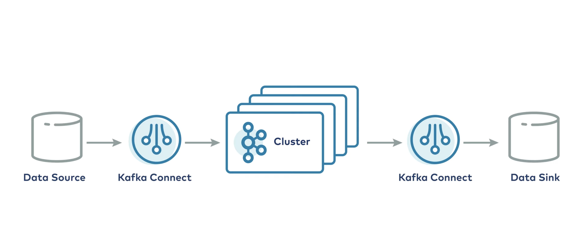

# Kafka Connect

## Overview

Kafka Connect is a framework for connecting Apache Kafka with external systems such as databases, key-value stores, search indexes, and file systems. It has a dual nature:

1. **Ecosystem**: A collection of pluggable connectors for various data sources and sinks
2. **Client Application**: A server process that acts as a producer/consumer to the Kafka cluster

## Key Features

- **Data Integration System**: Seamlessly integrates Kafka with external systems
- **External Client Process**: Runs independently from Kafka brokers on separate hardware
- **Horizontally Scalable**: Add workers to scale throughput and processing capacity
- **Fault Tolerant**: Automatic failover and task rebalancing ensure reliability
- **Pluggable Architecture**: Use pre-built connectors or develop custom ones

## Architecture



### Components

```
┌─────────────────────────────────────────────────┐
│           Kafka Connect Cluster                 │
│  ┌──────────┐  ┌──────────┐  ┌──────────┐       │
│  │ Worker 1 │  │ Worker 2 │  │ Worker N │       │
│  │          │  │          │  │          │       │
│  │ Task 1   │  │ Task 2   │  │ Task 3   │       │
│  │ Task 4   │  │          │  │          │       │
│  └──────────┘  └──────────┘  └──────────┘       │
└─────────────────────────────────────────────────┘
         ↑                             ↓
         │                             │
    ┌────┴─────────────────────────────┴────┐
    │        Kafka Cluster (Brokers)        │
    └────┬─────────────────────────────┬────┘
         ↑                             ↓
         │                             │
┌────────┴────────┐           ┌────────┴────────┐
│  Source System  │           │   Sink System   │
│   (Database,    │           │   (Database,    │
│   Files, etc.)  │           │   S3, etc.)     │
└─────────────────┘           └─────────────────┘
```

### Core Concepts

- **Connectors**: Pluggable software components that define the copying logic and coordinate tasks
- **Tasks**: Actual units of work that perform data movement (created and managed by connectors)
- **Workers**: JVM processes that run the Connect framework and execute tasks
- **Converters**: Handle serialization/deserialization between Kafka and external systems

## Deployment Modes

### Standalone Mode
- Single worker process
- Simple configuration file
- No fault tolerance or scalability
- Good for development and testing

```bash
bin/connect-standalone.sh config/connect-standalone.properties connector1.properties
```

### Distributed Mode
- Multiple worker processes
- Configuration stored in Kafka topics
- Fault tolerant and scalable
- Production-ready deployment

```bash
bin/connect-distributed.sh config/connect-distributed.properties
```

## Connector Configuration

### Common Properties

```json
{
  "name": "my-connector",
  "connector.class": "io.confluent.connect.jdbc.JdbcSourceConnector",
  "tasks.max": "3",
  "connection.url": "jdbc:postgresql://localhost:5432/mydb",
  "topics": "my-topic",
  "key.converter": "org.apache.kafka.connect.json.JsonConverter",
  "value.converter": "org.apache.kafka.connect.json.JsonConverter",
  "value.converter.schemas.enable": "true"
}
```

### Configuration Parameters

| Parameter | Description |
|-----------|-------------|
| `name` | Unique name for the connector instance |
| `connector.class` | Fully qualified class name of the connector |
| `tasks.max` | Maximum number of parallel tasks |
| `topics` | Kafka topics to read from or write to |
| `connection.url` | Connection string for external system |
| `key.converter` | Converter for message keys |
| `value.converter` | Converter for message values |
| `value.converter.schemas.enable` | Enable/disable schema in converted data |

## Connector Types

### Source Connectors
Stream data **from** external systems **into** Kafka topics
- Database CDC (Change Data Capture)
- File systems
- Message queues
- Cloud storage

### Sink Connectors
Stream data **from** Kafka topics **into** external systems
- Databases
- Search indexes (Elasticsearch)
- Data warehouses
- Cloud storage (S3, GCS)

## REST API

Kafka Connect provides a REST API for managing connectors:

### Common Endpoints

```bash
# List all connectors
GET /connectors

# Create a new connector
POST /connectors
Content-Type: application/json
{ "name": "...", "config": {...} }

# Get connector status
GET /connectors/{name}/status

# Delete a connector
DELETE /connectors/{name}

# Restart a connector
POST /connectors/{name}/restart

# Pause a connector
PUT /connectors/{name}/pause

# Resume a connector
PUT /connectors/{name}/resume
```

## Popular Connectors

### Open Source
- **JDBC Source/Sink Connector**: Database integration
- **File Source/Sink Connector**: File system integration
- **Elasticsearch Sink Connector**: Search index integration
- **S3 Sink Connector**: Cloud storage integration

### Commercial
- Debezium (CDC connectors)
- Confluent Hub connectors
- Custom enterprise connectors

## Best Practices

1. **Use Distributed Mode** for production deployments
2. **Monitor connector health** via REST API and metrics
3. **Configure appropriate task counts** based on data volume
4. **Enable schema registry** for data governance
5. **Use dead letter queues** for error handling
6. **Implement proper security** (SSL/TLS, SASL)
7. **Version control** connector configurations
8. **Test connectors** in non-production environments first

## Monitoring

Key metrics to monitor:
- Connector status and task states
- Throughput (records/sec)
- Lag and offset information
- Error rates and dead letter queue size
- Worker resource utilization

## Troubleshooting

### Common Issues

- **Connector fails to start**: Check connector configuration and logs
- **Tasks rebalancing frequently**: Investigate worker stability
- **Data not flowing**: Verify topic permissions and connector status
- **High lag**: Increase `tasks.max` or add more workers
- **Serialization errors**: Check converter configuration

### Logs Location
```
logs/connect.log
```

## Getting Started

### Prerequisites
- Apache Kafka cluster running
- Java 8+ installed
- Connector plugins available

### Quick Start

1. **Download and extract Kafka**
   ```bash
   wget https://downloads.apache.org/kafka/3.x.x/kafka_2.13-3.x.x.tgz
   tar -xzf kafka_2.13-3.x.x.tgz
   cd kafka_2.13-3.x.x
   ```

2. **Configure Connect worker**
   Edit `config/connect-distributed.properties`

3. **Start Connect worker**
   ```bash
   bin/connect-distributed.sh config/connect-distributed.properties
   ```

4. **Deploy a connector via REST API**
   ```bash
   curl -X POST http://localhost:8083/connectors \
     -H "Content-Type: application/json" \
     -d @connector-config.json
   ```

## Resources

- [Official Documentation](https://kafka.apache.org/documentation/#connect)
- [Confluent Hub](https://www.confluent.io/hub/) - Connector repository
- [Kafka Connect REST API](https://kafka.apache.org/documentation/#connect_rest)
- [Community Connectors](https://github.com/topics/kafka-connect)

## License

Apache License 2.0